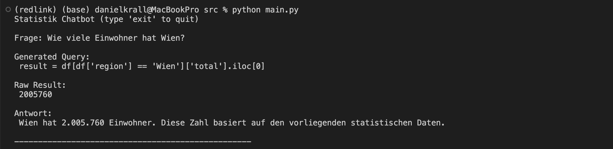
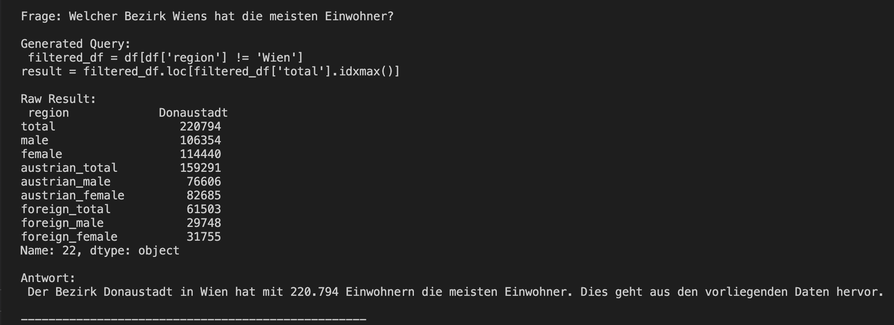
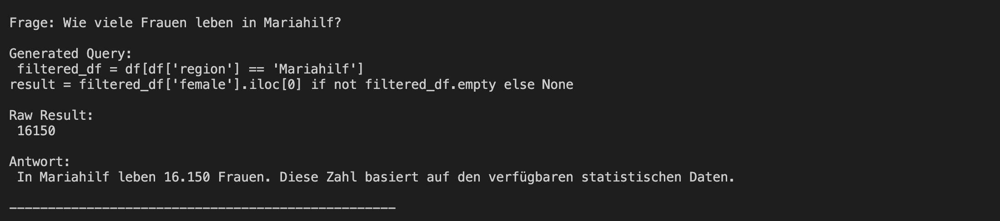

# Prototype

## Description
This is a small CLI-Tool for queries regarding statistical data in natural language.

## Architecture
- User Questions
- LLM generates pandas-queries
- Python executes the queries and gets a result
- LLM explains the result

## Used Data
- `wien_bevoelkerung.csv`
- Data is cleaned using `clean_data.py`
- Written into `cleaned_data.csv`

## Example Query
`Frage: Welcher Bezirk hat die meisten Einwohner?`

## Structure
````
02. Prototype/
│
├── src/
│   ├── data
│   │   ├── wien_bevoelkerung.csv      # Original data
│   │   └── cleaned_data.csv           # Cleaned data
│   ├── .env                           # API-Key
│   ├── clean_data.py                  # Python script to clean data
│   ├── llm.py                         # Connection to LLM
│   ├── prompts.py                     # Prompts
│   ├── query_engine.py                # Execution of Code
│   └── main.py                        # CLI-Tool
│
├── README.md
└── requirements.txt
````

## Setup
1. Rename `.examplenv` to `.env` and add your OpenAI API-Key
2. In `/02. Prototype`
- `python3 -m venv environment-name`
- `source environment-name/bin/activate`
- `pip install -r requirements.txt`

## Running the Tool
1. In `02. Prototype/src/` run
   - `python main.py`
2. Ask your Question
3. Receive an answer
   - `Generated Query` shows the generated pandas Query
   - `Raw Result` shows the Result of the Query (number)
   - `Antwort` is the natural language answer from the LLM.

## Examples


